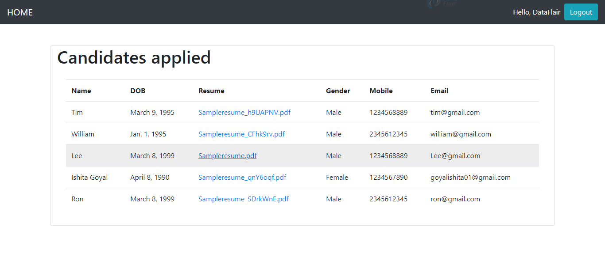
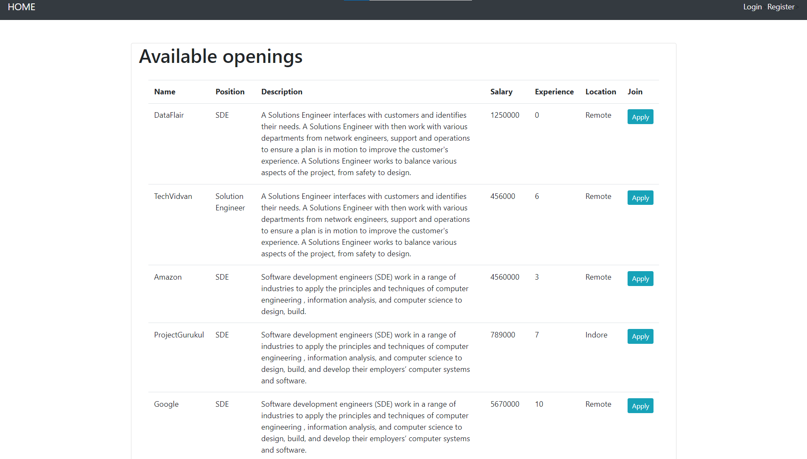

# Django E-commerce

This python project is to develop an online portal where recruiters can post job requirements, they can search for candidates. Candidates can search for job openings and apply.

## Users

- HR (Employer)
- Job Seeker (Student or Employee)
- Admin

## Job Portal Functionalities

- Login and Sign up for HR, not for Job Seekers because there are a lot of websites where they would be applying, so logging in and remembering all usernames and passwords would be really hectic and why would we want that? So it is better to ask about their information when they actually apply to some company. But HR would have access to details of the Job Seekers, for which authorization is required.
- Listing of available jobs.
- Resume upload and apply to an organization.
- List of all candidates to the HR.

# Final Product

----
# 🔗 Links - Rana Ahtsham

